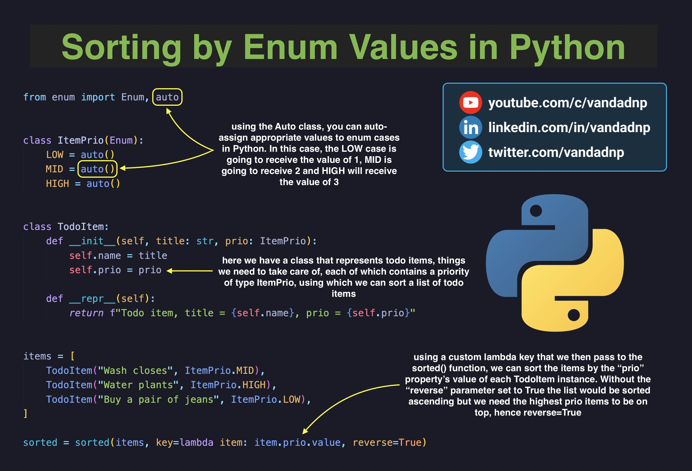
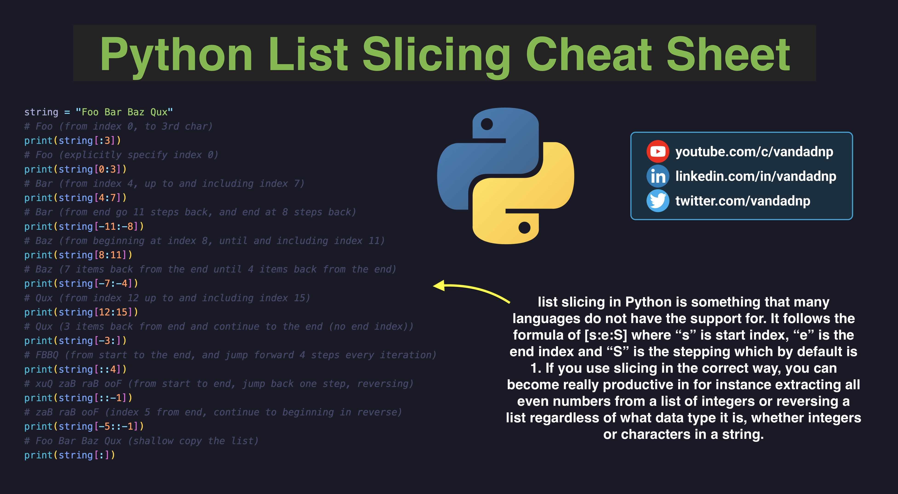
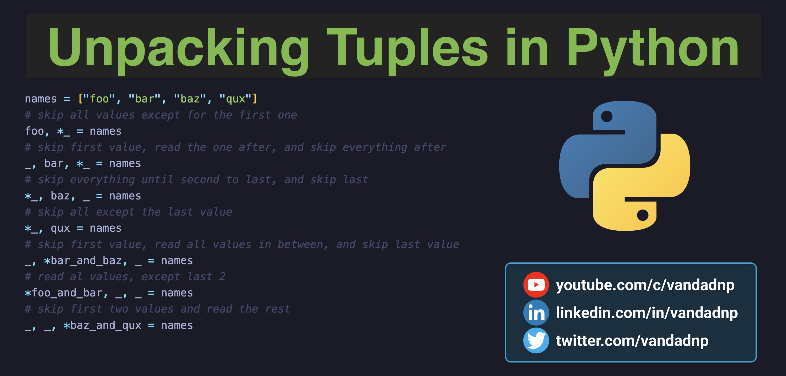
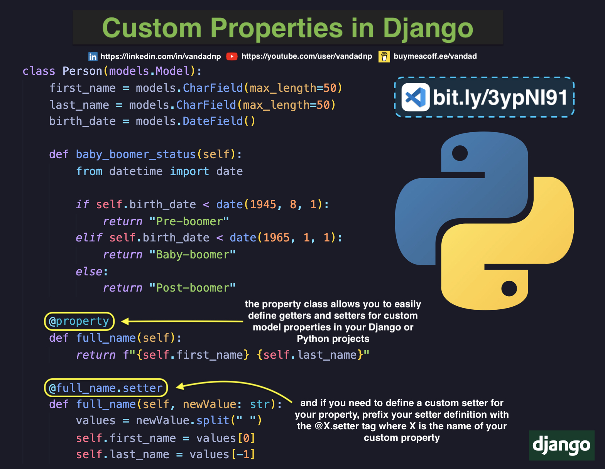

# Table of Contents

* [Sorting by Enum Values in Python](#sorting-by-enum-values-in-python)
* [Python List Slicing Cheat Sheet](#python-list-slicing-cheat-sheet)
* [Unpacking Tuples in Python](#unpacking-tuples-in-python)
* [Custom Properties in Django](#custom-properties-in-django)
* [Displaying Many to Many Fields in Django](#displaying-many-to-many-fields-in-django)
* [Inline Text Choices in Django](#inline-text-choices-in-django)
* [Decorators in Python](#decorators-in-python)
* [Implementing Range in Python](#implementing-range-in-python)

# Sorting by Enum Values in Python

[Source Code](source/sorting-by-enum-values-in-python.py)

# Python List Slicing Cheat Sheet

[Source Code](source/python-list-slicing-cheat-sheet.py)

# Unpacking Tuples in Python

[Source Code](source/unpacking-tuples-in-python.py)

# Custom Properties in Django

[Source Code](source/custom-properties-in-django.py)

# Displaying Many to Many Fields in Django

[Source Code](source/displaying-many-to-many-fields-in-django.py)

# Inline Text Choices in Django

[Source Code](source/inline-text-choices-in-django.py)

# Decorators in Python

# Implementing Range in Python

